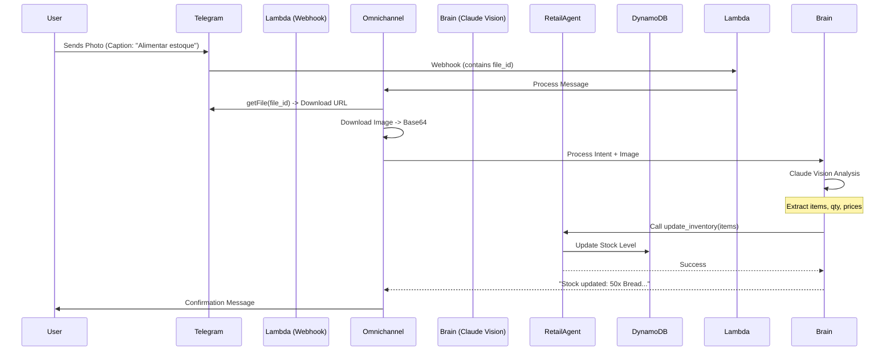

# Feature Spec: Inventory OCR (Vision)

## 1. Overview
Allow users to update inventory by sending a photo of an invoice (Nota Fiscal) or a product shelf via Telegram. The system uses Claude 3.5 Sonnet (Vision) to extract structured data and update the inventory via the Retail Agent.

## 2. User Story
**As a** Store Manager,
**I want to** take a photo of a supplier invoice,
**So that** the inventory is updated automatically without manual typing.

## 3. Architecture

## 4. Implementation Details

### 4.1 Telegram Adapter Update
- **File Handling:** Detect `photo` or `document` (PDF) in incoming updates.
- **Download:** Use `getFile` API to download content (max 20MB for bots).
- **Security:** Validate MIME types (jpeg, png, pdf).

### 4.2 Brain / LLM Prompts
**System Prompt Addition:**
> "You have vision capabilities. When receiving an image of an invoice (Nota Fiscal), extract the following JSON structure: {items: [{name: str, quantity: int, unit_price: float, total: float}]}. Ignore non-product lines."

### 4.3 Retail Agent Tool
- Reuse existing `update_inventory` tool.
- Ensure validation of extracted data (e.g., probability check).

## 5. Tasks
- [ ] **Telegram Adapter:** Add support for `photo` and `document` handling.
- [ ] **Omnichannel:** Implement `download_file` utility.
- [ ] **Brain:** Update prompt to support Vision inputs.
- [ ] **Feature:** Create `InvoiceProcessor` class in shared utilities.
- [ ] **Test:** Create test case with sample invoice image.
